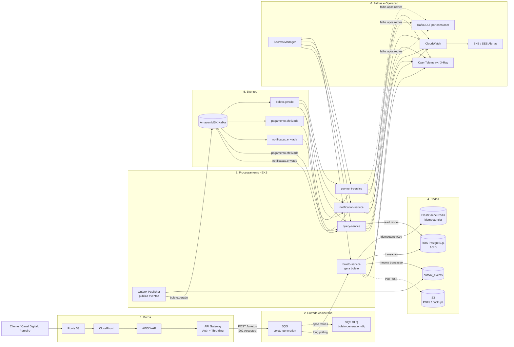
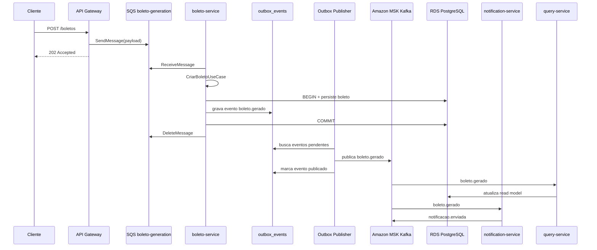

# Arquitetura AWS - Receber Bank Services

Este projeto agora possui uma base AWS alinhada aos diagramas em `arquitetura-final.drawio` e `arquitetura-recebimentos.drawio`.

## Mapeamento

| Camada | Local | AWS |
| --- | --- | --- |
| Entrada de criacao de boleto | Docker/REST local | API Gateway REST API publicando em SQS |
| Entrada de consulta | Docker ports locais | ALB Ingress no EKS para `query-service` |
| Compute | Containers Docker Compose | EKS |
| Imagens | Build local | ECR por microservico |
| Banco write/read model | PostgreSQL container | RDS PostgreSQL |
| Cache/idempotencia | Redis container | ElastiCache Redis |
| Fila de entrada | Nao local | SQS `boleto-generation` + DLQ |
| Event bus | Redpanda Kafka | Amazon MSK |
| Objetos/PDFs/backups | Nao local | S3 |
| Segredos | Variaveis locais | Secrets Manager + Kubernetes Secret |
| Logs/metricas | Logs locais / Actuator | CloudWatch + Actuator/Prometheus |
| Alertas | Nao local | SNS/SES |

## Desenho executivo

Visao horizontal, da esquerda para a direita, para apresentacao do case:



## Desenho simplificado

Versao curta para slide ou explicacao rapida:

```text
Cliente
  -> Route 53 / CloudFront / WAF
  -> API Gateway
  -> SQS boleto-generation
  -> boleto-service no EKS
  -> RDS PostgreSQL + outbox_events
  -> Outbox Publisher
  -> Amazon MSK Kafka
  -> payment-service / notification-service / query-service
  -> RDS read model
  -> CloudWatch + Tracing + Alertas
```

## Boas praticas representadas

| Pratica | Onde aparece no desenho |
| --- | --- |
| Entrada resiliente | API Gateway retornando `202 Accepted` e SQS absorvendo pico |
| Retry e DLQ na entrada | SQS + `boleto-generation-dlq` |
| Idempotencia | `Idempotency-Key` validada no Redis |
| ACID | Gravacao do boleto no RDS PostgreSQL |
| Consistencia banco/evento | Transactional Outbox com tabela `outbox_events` |
| Desacoplamento | MSK Kafka para eventos de dominio |
| DLQ por consumer | Kafka DLT por servico consumidor |
| Segurança | WAF, API Gateway Auth, Secrets Manager, IAM/IRSA |
| Observabilidade | CloudWatch, tracing distribuido e alertas |

## Fluxo principal AWS



## Recursos criados por Terraform

Pasta: `infra/aws/terraform`

- VPC com subnets publicas e privadas
- Internet Gateway e NAT Gateway
- Security Groups para EKS e dados
- EKS Cluster e node group
- ECR para `boleto-service`, `query-service`, `payment-service`, `notification-service`
- RDS PostgreSQL
- ElastiCache Redis
- SQS para entrada de geracao de boletos
- SQS DLQ para mensagens com falha
- API Gateway REST API integrado diretamente com SQS
- Amazon MSK
- S3 para documentos/PDFs e backups
- SNS para alertas
- Secrets Manager para credenciais
- CloudWatch Log Groups

## Manifests Kubernetes AWS

Pasta: `k8s/aws`

- `namespace.yaml`
- `configmap.yaml`
- `secret.example.yaml`
- `boleto-service.yaml`
- `query-service.yaml`
- `payment-service.yaml`
- `notification-service.yaml`
- `ingress-alb.yaml`

## Fluxo de deploy

1. Criar um arquivo de variaveis:

```bash
cd infra/aws/terraform
cp terraform.tfvars.example terraform.tfvars
```

2. Editar `terraform.tfvars`, principalmente `db_password`.

3. Criar infraestrutura:

```bash
terraform init
terraform plan
terraform apply
```

4. Configurar acesso ao EKS:

```bash
aws eks update-kubeconfig --region us-east-1 --name receber-bank-dev-eks
```

5. Buildar e publicar imagens no ECR usando os repositórios do output `ecr_repositories`.

6. Atualizar os campos `image:` em `k8s/aws/*-service.yaml` com as URLs do ECR.

7. Criar o secret Kubernetes com os outputs do Terraform:

```bash
cp k8s/aws/secret.example.yaml k8s/aws/secret.yaml
```

Preencher:

- `RDS_ENDPOINT`
- `REDIS_ENDPOINT`
- `MSK_BOOTSTRAP_SERVERS`
- `BOLETO_GENERATION_QUEUE_URL`
- `AWS_S3_DOCUMENTS_BUCKET`
- `AWS_SNS_ALERTS_TOPIC_ARN`

8. Aplicar manifests:

```bash
kubectl apply -f k8s/aws/namespace.yaml
kubectl apply -f k8s/aws/configmap.yaml
kubectl apply -f k8s/aws/secret.yaml
kubectl apply -f k8s/aws/boleto-service.yaml
kubectl apply -f k8s/aws/query-service.yaml
kubectl apply -f k8s/aws/payment-service.yaml
kubectl apply -f k8s/aws/notification-service.yaml
kubectl apply -f k8s/aws/ingress-alb.yaml
```

## Observacoes

- O projeto continua com `docker-compose.yml` para desenvolvimento local.
- Na AWS, criacao de boleto entra por API Gateway e SQS; Kafka/MSK continua como event bus interno apos a geracao do boleto.
- O ALB Ingress fica focado em consultas do `query-service`.
- S3 e SNS/SES estao provisionados para a evolucao de PDFs, backups e alertas, mas a logica de negocio atual ainda esta focada no fluxo Kafka.
- Para producao real, o proximo refinamento recomendado e instalar/configurar o AWS Load Balancer Controller, External Secrets Operator e IRSA por service account em vez de permissao ampla no node role.
